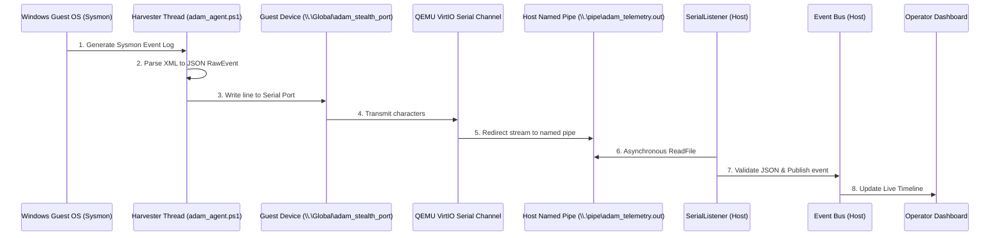

# ADAM Stealth Sandbox Architecture (Version 2)

This document describes the design, data flows, and configuration parameters of the continuous, triggerless, and network-stealthy malware analysis sandbox environment.

---

## 1. Core Principles

Traditional malware sandboxes use guest-side host-only networking to send telemetry (Sysmon, Procmon) to the host. However, advanced malware uses simple anti-analysis checks (such as scanning open TCP connections, checking routing tables, or scanning system sockets) to detect network control channels and cease malicious behavior.

ADAM V2 mitigates this evasion by using **Out-of-Band Telemetry**:
1. **Zero Network Footprint**: Telemetry is written directly to a VirtIO character device (`\\.\Global\adam_stealth_port`) inside the guest. There is no socket binding, no TCP/UDP packet overhead, and no routing trace.
2. **Triggerless Execution**: The guest VM runs continuously. The agent continuously monitors and streams event logs from boot time, mapping them to a persistent live session (`sess_continuous_live`).
3. **Hypervisor Introspection Interface**: QEMU maps the guest character port to a host-side Windows Named Pipe (`\\.\pipe\adam_telemetry`), which the host orchestrator parses asynchronously.

---

## 2. Directory Structure

```
├── config/
│   └── default.toml                     # manage_vm = false, use_virtio_serial = true
├── adam/
│   ├── common/
│   │   └── config.py                    # Schema supporting serial options
│   ├── orchestrator/
│   │   └── serial_listener.py           # Host Named Pipe async server daemon
│   ├── sandbox/
│   │   ├── controller.py                # Bypasses QEMU client start/stop in manual mode
│   │   └── guest/
│   │       └── agent/
│   │           └── adam_agent.ps1       # Multi-threaded guest harvester script
│   ├── api/
│   │   ├── main.py                      # Starts Pipe server on lifespans
│   │   └── deps.py                      # Composition root exposing pipe server
```

---

## 3. Data Flow & Redirection Pipeline

The sequence below illustrates the telemetry extraction pathway:



---

## 4. Hardware Configuration (QEMU Bindings)

To support this out-of-band communication, QEMU is launched with the following device arguments:

* `-device virtio-serial`: Initializes a VirtIO serial controller bus.
* `-chardev pipe,id=charmon0,path=\\.\pipe\adam_telemetry`: Redirects a character device backend to the host named pipe.
* `-device virtserialport,chardev=charmon0,name=adam_stealth_port`: Exposes the port to the guest system under the alias `adam_stealth_port`.
